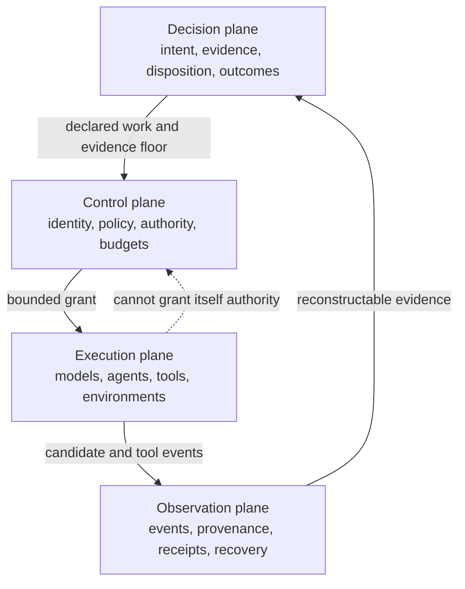
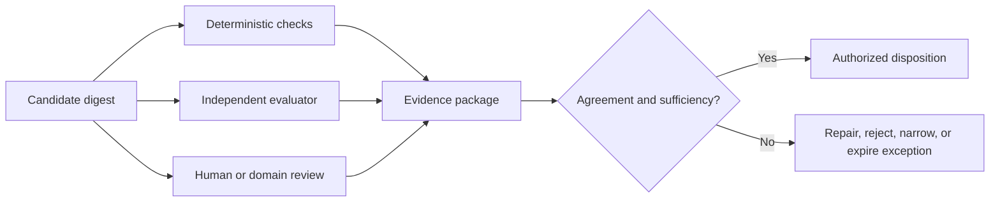
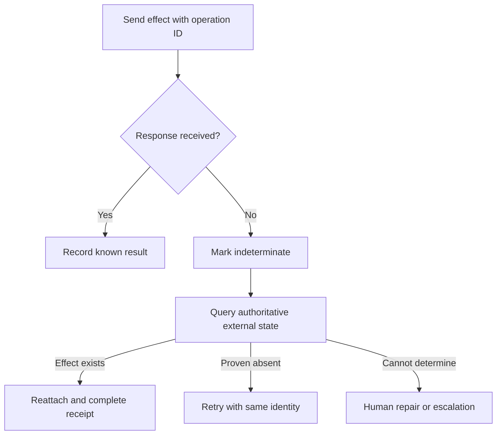
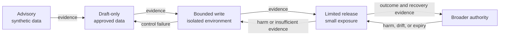

# Accountable Factory Visual Guide

These diagrams are conceptual, vendor-neutral teaching views. They do not
describe Merlin's production topology. GitHub renders the Mermaid sources;
copy them into any Mermaid-compatible editor for workshops.

## 1. The accountability spine

**Workshop question:** Which link in your present process exists only in a chat
transcript or a person's memory?

## 2. Four responsibility planes

**Workshop question:** Can the execution path change the policy, evidence
requirement, or judge that controls it?

## 3. Evidence and disposition are different

**Workshop question:** Who can disposition disagreement, and what happens when
that person is absent?

## 4. Reconciliation before retry

**Workshop question:** Which of your adapters interprets a timeout as proof
that nothing happened?

## 5. Authority expands one dimension at a time

**Workshop question:** Can you name the single authority dimension being
expanded and the evidence that would contract it again?
