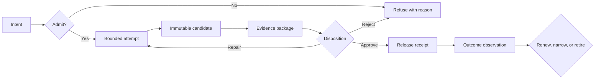

# Build a Minimum Viable Accountable Factory

Build one narrow path through the accountability spine before selecting a
large platform or connecting an agent to production. The target is not maximum
automation. It is one consequential result another operator can justify,
recover, and later retire.

## The finish line

For one frequent, reversible work class, your path must accept a versioned Work
Order, grant bounded authority, produce a candidate, collect artifact-bound
evidence, preserve disagreement, record human disposition, create an
attributable receipt, reconcile interruption, and observe an outcome.

## Step 1 — Select the work class

Choose work that is frequent enough to observe, narrow enough to describe,
reversible enough to learn from, and consequential enough to matter. Avoid
crossing production-write, customer-communication, or financial-effect
boundaries in the first path.

Complete:

- [`factory-charter-template.md`](../templates/factory-charter-template.md)
- [`accountable-factory-diagnostic.md`](../assessment/accountable-factory-diagnostic.md)

**Exit test:** eligible and ineligible examples are explicit, and a request
outside scope is refused before execution.

## Step 2 — Make intent durable

Create a Work Order with a promise, beneficiary, criteria, prohibitions,
assumptions, unresolved decisions, owners, authority request, budgets, evidence
floor, recovery expectations, and outcome window.

Use [`work-order-template.md`](../templates/work-order-template.md) and validate
the example structure with [`work-order.schema.json`](../schemas/work-order.schema.json).

**Exit test:** a second operator can distinguish required outcomes from
implementation suggestions without reading a chat transcript.

## Step 3 — Enforce authority outside the model

Bind identity, readable data, tools, writable locations, environment,
communication, budget, time, concurrency, and delegation to the admitted Work
Order. A prompt may explain the boundary; it must not be the boundary.

Use:

- [`factory-threat-model.md`](../templates/factory-threat-model.md)
- [`decision-rights-matrix.md`](../templates/decision-rights-matrix.md)
- [`provider-tenant-capacity-design.md`](../templates/provider-tenant-capacity-design.md)

**Exit test:** a persuasive request for one prohibited capability is denied by
deterministic machinery and recorded.

## Step 4 — Preserve candidate identity

Store or hash the exact candidate before evaluation. Every verdict names the
candidate digest, criterion, evaluator identity, method, result, timestamp,
and limitations.

Use [`evidence-record.schema.json`](../schemas/evidence-record.schema.json).

**Exit test:** changing one byte of the candidate makes prior evidence stale.

## Step 5 — Separate evidence from disposition

Evidence reports what a method observed. Disposition decides what the
organization will do with the resulting uncertainty. Do not let the producer
author its own decisive verdict.

Use:

- [`risk-to-evidence-matrix.md`](../templates/risk-to-evidence-matrix.md)
- [`human-judgment-placement.md`](../templates/human-judgment-placement.md)

**Exit test:** conflicting evaluators remain visible until an authorized actor
repairs, rejects, accepts, or creates an expiring exception.

## Step 6 — Release with a receipt

Record what promise, candidate, authority, evidence, and human decision
justified the effect; who owns recovery; what exposure was granted; and how the
effect can be reversed.

Use [`factory-receipt.schema.json`](../schemas/factory-receipt.schema.json).

**Exit test:** an operator can reconstruct why the exact artifact reached the
exact exposure without trusting an agent transcript.

## Step 7 — Reconcile before retry

Give each consequential operation a semantic identity. If the response is
lost, mark the operation indeterminate, observe authoritative external state,
and choose reattach, proven-safe retry, repair, or human escalation.

**Exit test:** the lost-response drill produces one external effect, not two.

## Step 8 — Observe the outcome

Separate activity, delivery, outcome, and supportability. Record the primary
measure, countermetrics, window, denominator, confounders, and one of five
dispositions: effective, ineffective, insufficient, harmful, or not yet due.

Use [`outcome-observation.schema.json`](../schemas/outcome-observation.schema.json)
and [`factory-outcome-scorecard.md`](../templates/factory-outcome-scorecard.md).

**Exit test:** a technically successful release can still narrow or retire
authority when outcome or burden evidence warrants it.

## Step 9 — Test the complete unhappy path

Run the [`failure laboratory`](../exercises/failure-laboratory.md). Do not
connect the path to production until refusal, stale evidence, disagreement,
budget exhaustion, interruption, rollback, and absent-human behavior are
observable.

## Step 10 — Decide the next boundary

Use the [`ninety-day pilot workbook`](../templates/ninety-day-pilot-workbook.md)
and [`comparative pilot protocol`](../templates/comparative-pilot-protocol.md).
Change one dimension: work class, data, tool, environment, exposure, budget,
concurrency, delegation, or duration. Every expansion remains reversible.

## What this guide deliberately does not choose

It does not prescribe a model, agent framework, vector store, cloud, CI system,
policy engine, database, or deployment tool. Those are replaceable components.
The organization still owns the accountability contract connecting them.
